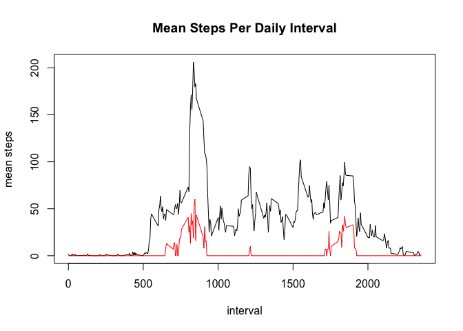

# Reproducible Research: Peer Assessment 1
William L. Kennedy  


## Loading and preprocessing the data


```r
# Package dependencies (uncomment and install if necessary)

# install.packages("data.table")
# install.packages("lubridate")
library(data.table)
library(lubridate)
```

```
## 
## Attaching package: 'lubridate'
## 
## The following objects are masked from 'package:data.table':
## 
##     hour, mday, month, quarter, wday, week, yday, year
```

```r
# set the working directory (replace path accordingly)
setwd("/Users/adakemia/Documents/Academic/Coursera/DataScienceSpecialization/05ReproducibleResearch/Projects/RepData_PeerAssessment1")

# List and check for necessary files
url <- "https://d396qusza40orc.cloudfront.net/repdata%2Fdata%2Factivity.zip"
zfile <- "activity.zip"
file <- "activity.csv"

if (!file.exists(file)) {
        if (!file.exists(zfile)) {
                method <- switch(Sys.info()[['sysname']],
                                 "Windows" = "internal",
                                 "Darwin" = "curl",
                                 "Linux" = "wget",
                                 "auto")
                download.file(url, destfile=zfile, method)
                }
        unzip(zfile, exdir="./")
}

# Read files into data.table object
data <- fread(file, sep=",", stringsAsFactors=F, header=T, 
              na.strings="NA", colClasses=c("numeric","character","character"))
# Check structure of data
str(data)
```

```
## Classes 'data.table' and 'data.frame':	17568 obs. of  3 variables:
##  $ steps   : num  NA NA NA NA NA NA NA NA NA NA ...
##  $ date    : chr  "2012-10-01" "2012-10-01" "2012-10-01" "2012-10-01" ...
##  $ interval: chr  "0" "5" "10" "15" ...
##  - attr(*, ".internal.selfref")=<externalptr>
```

```r
# Process data

# Set date formatting (lubridate package)
data[,date := ymd(date)]
```

```
##        steps       date interval
##     1:    NA 2012-10-01        0
##     2:    NA 2012-10-01        5
##     3:    NA 2012-10-01       10
##     4:    NA 2012-10-01       15
##     5:    NA 2012-10-01       20
##    ---                          
## 17564:    NA 2012-11-30     2335
## 17565:    NA 2012-11-30     2340
## 17566:    NA 2012-11-30     2345
## 17567:    NA 2012-11-30     2350
## 17568:    NA 2012-11-30     2355
```

```r
# Data quality checks

# Check for missingness
colSums(is.na(data))
```

```
##    steps     date interval 
##     2304        0        0
```

```r
# Percent missing
sum(is.na(data$steps)) / nrow(data) * 100
```

```
## [1] 13.11475
```

```r
# Check timeseries
data[,unique(date)]
```

```
##  [1] "2012-10-01 UTC" "2012-10-02 UTC" "2012-10-03 UTC" "2012-10-04 UTC"
##  [5] "2012-10-05 UTC" "2012-10-06 UTC" "2012-10-07 UTC" "2012-10-08 UTC"
##  [9] "2012-10-09 UTC" "2012-10-10 UTC" "2012-10-11 UTC" "2012-10-12 UTC"
## [13] "2012-10-13 UTC" "2012-10-14 UTC" "2012-10-15 UTC" "2012-10-16 UTC"
## [17] "2012-10-17 UTC" "2012-10-18 UTC" "2012-10-19 UTC" "2012-10-20 UTC"
## [21] "2012-10-21 UTC" "2012-10-22 UTC" "2012-10-23 UTC" "2012-10-24 UTC"
## [25] "2012-10-25 UTC" "2012-10-26 UTC" "2012-10-27 UTC" "2012-10-28 UTC"
## [29] "2012-10-29 UTC" "2012-10-30 UTC" "2012-10-31 UTC" "2012-11-01 UTC"
## [33] "2012-11-02 UTC" "2012-11-03 UTC" "2012-11-04 UTC" "2012-11-05 UTC"
## [37] "2012-11-06 UTC" "2012-11-07 UTC" "2012-11-08 UTC" "2012-11-09 UTC"
## [41] "2012-11-10 UTC" "2012-11-11 UTC" "2012-11-12 UTC" "2012-11-13 UTC"
## [45] "2012-11-14 UTC" "2012-11-15 UTC" "2012-11-16 UTC" "2012-11-17 UTC"
## [49] "2012-11-18 UTC" "2012-11-19 UTC" "2012-11-20 UTC" "2012-11-21 UTC"
## [53] "2012-11-22 UTC" "2012-11-23 UTC" "2012-11-24 UTC" "2012-11-25 UTC"
## [57] "2012-11-26 UTC" "2012-11-27 UTC" "2012-11-28 UTC" "2012-11-29 UTC"
## [61] "2012-11-30 UTC"
```

```r
plot(data$interval[11:14], type="l")
```

 

```r
data[11:14]
```

```
##    steps       date interval
## 1:    NA 2012-10-01       50
## 2:    NA 2012-10-01       55
## 3:    NA 2012-10-01      100
## 4:    NA 2012-10-01      105
```

```r
# Fix hour/min anomaly
```


## What is mean total number of steps taken per day?  
First, we can take a wide view via a histogram. We can see several things from the histogram:  
* The shape is relatively normal  
* Due to normality, we would expect mean and median to be fairly close  
* We would expect the mean and median to fall roughly just over 10,000 steps  
---


```r
hist(data[,sum(steps), by=date]$V1, breaks=8, 
     main="Histogram of Mean Steps Per Day",
     xlab="mean steps per day")
```

 
  
Next, we can compare to the actual mean and median for the entire period. As expected, the mean and median are very close and just over 10,000 steps.  


```r
data[, .(sum = sum(steps)), by=date][,.(median = median(sum, na.rm=T),
                                        mean = mean(sum, na.rm=T))]
```

```
##    median     mean
## 1:  10765 10766.19
```

## What is the average daily activity pattern?


```r
ts <- data[, .(mean = round( mean(steps, na.rm=T), 2)), by=interval]

plot(ts$mean ~ ts$interval, type="l", main="Mean Steps Per Daily Interval",
     xlab="interval", ylab="mean steps")
```

 

```r
ts[which.max(mean)]
```

```
##    interval   mean
## 1:      835 206.17
```
## Imputing missing values


```r
# create a second imputed data set
data_imp <- data

ts2 <- data_imp[, .(median = median(steps, na.rm=T),
                    mean = mean(steps, na.rm=T)), 
                by=interval]
# Compare mean and median by interval 
plot(ts2$mean ~ ts2$interval, type="l", main="Mean Steps Per Daily Interval",
     xlab="interval", ylab="mean steps")
lines(ts2$median ~ ts2$interval, col="red")
```

 

```r
data[interval == 1000]
```

```
##     steps       date interval
##  1:    NA 2012-10-01     1000
##  2:     0 2012-10-02     1000
##  3:     0 2012-10-03     1000
##  4:     0 2012-10-04     1000
##  5:     0 2012-10-05     1000
##  6:    16 2012-10-06     1000
##  7:   281 2012-10-07     1000
##  8:    NA 2012-10-08     1000
##  9:    23 2012-10-09     1000
## 10:   400 2012-10-10     1000
## 11:     0 2012-10-11     1000
## 12:     0 2012-10-12     1000
## 13:     0 2012-10-13     1000
## 14:   392 2012-10-14     1000
## 15:     0 2012-10-15     1000
## 16:     0 2012-10-16     1000
## 17:    92 2012-10-17     1000
## 18:     0 2012-10-18     1000
## 19:     0 2012-10-19     1000
## 20:     0 2012-10-20     1000
## 21:     0 2012-10-21     1000
## 22:     0 2012-10-22     1000
## 23:     0 2012-10-23     1000
## 24:     0 2012-10-24     1000
## 25:     0 2012-10-25     1000
## 26:     0 2012-10-26     1000
## 27:     0 2012-10-27     1000
## 28:     0 2012-10-28     1000
## 29:   104 2012-10-29     1000
## 30:     0 2012-10-30     1000
## 31:   122 2012-10-31     1000
## 32:    NA 2012-11-01     1000
## 33:   487 2012-11-02     1000
## 34:     0 2012-11-03     1000
## 35:    NA 2012-11-04     1000
## 36:     0 2012-11-05     1000
## 37:     0 2012-11-06     1000
## 38:     8 2012-11-07     1000
## 39:     0 2012-11-08     1000
## 40:    NA 2012-11-09     1000
## 41:    NA 2012-11-10     1000
## 42:     0 2012-11-11     1000
## 43:     0 2012-11-12     1000
## 44:     0 2012-11-13     1000
## 45:    NA 2012-11-14     1000
## 46:     0 2012-11-15     1000
## 47:    18 2012-11-16     1000
## 48:     0 2012-11-17     1000
## 49:     0 2012-11-18     1000
## 50:     0 2012-11-19     1000
## 51:     0 2012-11-20     1000
## 52:     0 2012-11-21     1000
## 53:     0 2012-11-22     1000
## 54:     0 2012-11-23     1000
## 55:     0 2012-11-24     1000
## 56:     0 2012-11-25     1000
## 57:     0 2012-11-26     1000
## 58:   207 2012-11-27     1000
## 59:     0 2012-11-28     1000
## 60:     0 2012-11-29     1000
## 61:    NA 2012-11-30     1000
##     steps       date interval
```

```r
data_imp[, .(median = median(steps, na.rm=T),
                    mean = mean(steps, na.rm=T)), 
                by=list(interval, wday(date))][interval==900]
```

```
##    interval wday median      mean
## 1:      900    2     71 249.85714
## 2:      900    3     36 134.00000
## 3:      900    4     14 137.50000
## 4:      900    5      0 137.75000
## 5:      900    6     16 218.14286
## 6:      900    7     20 112.14286
## 7:      900    1     15  19.14286
```

```r
ts2[interval == 900]
```

```
##    interval median     mean
## 1:      900     20 143.4528
```

```r
data[interval == 900]
```

```
##     steps       date interval
##  1:    NA 2012-10-01      900
##  2:     0 2012-10-02      900
##  3:     0 2012-10-03      900
##  4:     0 2012-10-04      900
##  5:   530 2012-10-05      900
##  6:    30 2012-10-06      900
##  7:    23 2012-10-07      900
##  8:    NA 2012-10-08      900
##  9:   134 2012-10-09      900
## 10:   135 2012-10-10      900
## 11:   548 2012-10-11      900
## 12:   802 2012-10-12      900
## 13:    18 2012-10-13      900
## 14:    15 2012-10-14      900
## 15:   732 2012-10-15      900
## 16:    36 2012-10-16      900
## 17:   668 2012-10-17      900
## 18:    55 2012-10-18      900
## 19:    15 2012-10-19      900
## 20:     0 2012-10-20      900
## 21:     0 2012-10-21      900
## 22:    71 2012-10-22      900
## 23:   400 2012-10-23      900
## 24:     0 2012-10-24      900
## 25:     0 2012-10-25      900
## 26:   164 2012-10-26      900
## 27:   519 2012-10-27      900
## 28:    23 2012-10-28      900
## 29:     4 2012-10-29      900
## 30:     0 2012-10-30      900
## 31:     0 2012-10-31      900
## 32:    NA 2012-11-01      900
## 33:    16 2012-11-02      900
## 34:   198 2012-11-03      900
## 35:    NA 2012-11-04      900
## 36:   363 2012-11-05      900
## 37:   433 2012-11-06      900
## 38:    28 2012-11-07      900
## 39:     0 2012-11-08      900
## 40:    NA 2012-11-09      900
## 41:    NA 2012-11-10      900
## 42:     0 2012-11-11      900
## 43:   539 2012-11-12      900
## 44:     0 2012-11-13      900
## 45:    NA 2012-11-14      900
## 46:     0 2012-11-15      900
## 47:     0 2012-11-16      900
## 48:    20 2012-11-17      900
## 49:    11 2012-11-18      900
## 50:     0 2012-11-19      900
## 51:   203 2012-11-20      900
## 52:   269 2012-11-21      900
## 53:   499 2012-11-22      900
## 54:     0 2012-11-23      900
## 55:     0 2012-11-24      900
## 56:    62 2012-11-25      900
## 57:    40 2012-11-26      900
## 58:     0 2012-11-27      900
## 59:     0 2012-11-28      900
## 60:     0 2012-11-29      900
## 61:    NA 2012-11-30      900
##     steps       date interval
```

## Are there differences in activity patterns between weekdays and weekends?
