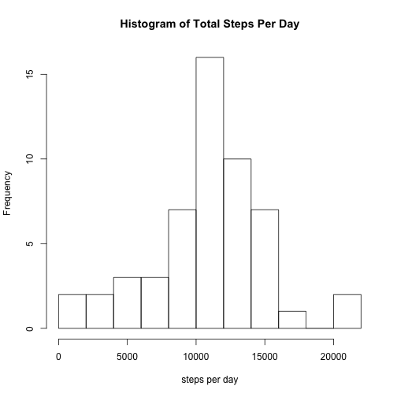
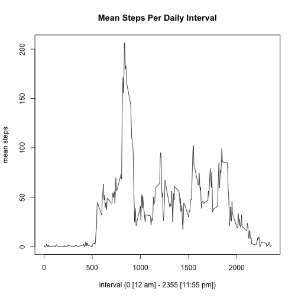

### Abstract  
  
This is a short report of data from a personal activity monitor collecting 5-minute interval data on the number of steps taken in a day. The data is two months worth from October and November 2012. Mean steps taken per day were 10,766 and the maximum 5-minute interval average suggested 206 steps at 8:35 a.m. Differences between weekday and weekend activity patterns are suggested by the data.  
  
### Loading and preprocessing the data


```r
if(!"data.table" %in% installed.packages())install.packages("data.table")
if(!"lubridate" %in% installed.packages())install.packages("lubridate")
if(!"lattice" %in% installed.packages())install.packages("lattice")
library(data.table)
```

```
## data.table 1.9.4  For help type: ?data.table
## *** NB: by=.EACHI is now explicit. See README to restore previous behaviour.
```

```r
library(lubridate)
```

```
## 
## Attaching package: 'lubridate'
## 
## The following objects are masked from 'package:data.table':
## 
##     hour, mday, month, quarter, wday, week, yday, year
```

```r
library(lattice)

# set the working directory (replace path accordingly)
setwd("~/Documents/Academic/Coursera/DataScienceSpecialization/05ReproducibleResearch/Projects/RepData_PeerAssessment1")

# List and check for necessary files
url <- "https://d396qusza40orc.cloudfront.net/repdata%2Fdata%2Factivity.zip"
zfile <- "activity.zip"
file <- "activity.csv"

if (!file.exists(file)) {
        if (!file.exists(zfile)) {
                method <- switch(Sys.info()[['sysname']],
                                 "Windows" = "internal",
                                 "Darwin" = "curl",
                                 "Linux" = "wget",
                                 "auto")
                download.file(url, destfile=zfile, method)
                }
        unzip(zfile, exdir="./")
}

# Read files into data.table object
data <- fread(file, sep=",", stringsAsFactors=F, header=T, 
              na.strings="NA", colClasses=c("numeric","character","numeric"))
# Check structure of data
str(data)
```

```
## Classes 'data.table' and 'data.frame':	17568 obs. of  3 variables:
##  $ steps   : num  NA NA NA NA NA NA NA NA NA NA ...
##  $ date    : chr  "2012-10-01" "2012-10-01" "2012-10-01" "2012-10-01" ...
##  $ interval: num  0 5 10 15 20 25 30 35 40 45 ...
##  - attr(*, ".internal.selfref")=<externalptr>
```

```r
# Process data

# Set date formatting (lubridate package)
data[,date := ymd(date)]
```

```
##        steps       date interval
##     1:    NA 2012-10-01        0
##     2:    NA 2012-10-01        5
##     3:    NA 2012-10-01       10
##     4:    NA 2012-10-01       15
##     5:    NA 2012-10-01       20
##    ---                          
## 17564:    NA 2012-11-30     2335
## 17565:    NA 2012-11-30     2340
## 17566:    NA 2012-11-30     2345
## 17567:    NA 2012-11-30     2350
## 17568:    NA 2012-11-30     2355
```
  

### What is mean total number of steps taken per day?  
First, we can take a quick view of the data via a histogram. We can see several things from the histogram:  
  
1. The shape is relatively normal  
2. Due to normality, we would expect mean and median to be fairly close  
3. We would expect the mean and median to fall roughly just over 10,000 steps  


```r
hist(data[,sum(steps), by=date]$V1, breaks=10, 
     main="Histogram of Total Steps Per Day",
     xlab="steps per day")
```

 
  
Next, we can compare to the actual mean and median for the entire period. As expected, the mean and median are very close and just over 10,000 steps.  


```r
data[, .(sum = sum(steps)), by=date][,.(median = median(sum, na.rm=T),
                                        mean = mean(sum, na.rm=T))]
```

```
##    median     mean
## 1:  10765 10766.19
```

### What is the average daily activity pattern?  
  
So what does a typical day look like for this individual? First, we can create a time series based on the mean for each time interval across all days. By plotting this timeseries, we can see qualitatively what a typical day looks like.   

In this case, we see that activity begins around 5 am, there is, on average, a large spike in activity in the morning around 8:30 am followed by spikes around noon, mid-afternoon, and then early evening perhaps corresponding to morning exercise, lunch, afternoon break, and returning home. It might be interesting to compare weekend and weekday patterns. And that is what we show below in the last section.  


```r
ts <- data[, .(mean = round( mean(steps, na.rm=T), 2)), by=interval]

plot(ts$mean ~ ts$interval, type="l", main="Mean Steps Per Daily Interval",
     xlab="interval (0 [12 am] - 2355 [11:55 pm])", ylab="mean steps")
```

 
  
Now we can look at specific descriptives like the interval with the average maximum number of steps. As expected from the time series plot, it is 8:35 am.  


```r
ts[which.max(mean)]
```

```
##    interval   mean
## 1:      835 206.17
```
### Imputing missing values  
  
Imputing missing values is a tricky but important task. Using listwise deletion is known to be more biased than other methods. On the other hand, more complex methods will be less biased than replacing with means or medians. For this exercise, I am using the mean to impute the missing values, but, first, I compared both mean and medium values below.  
  
  
Number missing:  
  

```r
# Check for missingness
colSums(is.na(data))
```

```
##    steps     date interval 
##     2304        0        0
```
  
Percent missing:  
  

```r
# Percent missing
round(sum(is.na(data$steps)) / nrow(data) * 100, 2)
```

```
## [1] 13.11
```
  
This is high enough percentage to expect a change after imputing.
  
  
Now I will visually compare mean and median by interval to see the difference.
  
  

```r
# Compare mean and median by interval 
ts2 <- data[, .(median = median(steps, na.rm=T),
                    mean = mean(steps, na.rm=T)), 
                by=interval]

plot(ts2$mean ~ ts2$interval, type="l", main="Mean Steps Per Daily Interval",
     xlab="interval", ylab="mean steps")
lines(ts2$median ~ ts2$interval, col="red")
legend("topright",legend=c("mean","median"),lty=1, col=c("black", "red"))
```

 
  
Here I will impute with median just to compare with mean later.
  

```r
data_imp <- merge(data, ts2, by="interval", all=T)
data_imp[is.na(steps),steps := median]
```

```
##        interval steps       date median     mean
##     1:        0     0 2012-10-01      0 1.716981
##     2:        0     0 2012-10-02      0 1.716981
##     3:        0     0 2012-10-03      0 1.716981
##     4:        0    47 2012-10-04      0 1.716981
##     5:        0     0 2012-10-05      0 1.716981
##    ---                                          
## 17564:     2355     0 2012-11-26      0 1.075472
## 17565:     2355     0 2012-11-27      0 1.075472
## 17566:     2355     0 2012-11-28      0 1.075472
## 17567:     2355     0 2012-11-29      0 1.075472
## 17568:     2355     0 2012-11-30      0 1.075472
```

```r
data_imp[, .(sum = sum(steps)), by=date][,.(median = median(sum, na.rm=T),
                                        mean = mean(sum, na.rm=T))]
```

```
##    median     mean
## 1:  10395 9503.869
```
  
With the smaller values of median inserted, the mean seems to be drawn down significantly. 
  
  
Now I'll try imputing with mean.  
  
  


```r
data_imp_mean <- merge(data, ts2, by="interval", all=T)
data_imp_mean[is.na(steps),steps := mean]
```

```
##        interval     steps       date median     mean
##     1:        0  1.716981 2012-10-01      0 1.716981
##     2:        0  0.000000 2012-10-02      0 1.716981
##     3:        0  0.000000 2012-10-03      0 1.716981
##     4:        0 47.000000 2012-10-04      0 1.716981
##     5:        0  0.000000 2012-10-05      0 1.716981
##    ---                                              
## 17564:     2355  0.000000 2012-11-26      0 1.075472
## 17565:     2355  0.000000 2012-11-27      0 1.075472
## 17566:     2355  0.000000 2012-11-28      0 1.075472
## 17567:     2355  0.000000 2012-11-29      0 1.075472
## 17568:     2355  1.075472 2012-11-30      0 1.075472
```

```r
hist(data_imp_mean[,sum(steps), by=date]$V1, breaks=8, 
     main="Histogram of Total Steps Per Day",
     xlab="steps per day")
```

 

```r
data_imp_mean[, .(sum = sum(steps)), by=date][,.(median = median(sum, na.rm=T),
                                        mean = mean(sum, na.rm=T))]
```

```
##      median     mean
## 1: 10766.19 10766.19
```
  
  
Using the mean seems to result in a more normal distribution suggested by the equality between mean and median.  
  
  
### Are there differences in activity patterns between weekdays and weekends?  
  
Differences between weekday and weekend activity as shown in the plot below include a slower rise in activity on weekend mornings, as well as higher activity variability throughout the day and evening.  


```r
# add weekday factor
data_imp_mean[, weekday := ifelse(wday(date) %in% c(2:6),"weekday","weekend")]
```

```
##        interval     steps       date median     mean weekday
##     1:        0  1.716981 2012-10-01      0 1.716981 weekday
##     2:        0  0.000000 2012-10-02      0 1.716981 weekday
##     3:        0  0.000000 2012-10-03      0 1.716981 weekday
##     4:        0 47.000000 2012-10-04      0 1.716981 weekday
##     5:        0  0.000000 2012-10-05      0 1.716981 weekday
##    ---                                                      
## 17564:     2355  0.000000 2012-11-26      0 1.075472 weekday
## 17565:     2355  0.000000 2012-11-27      0 1.075472 weekday
## 17566:     2355  0.000000 2012-11-28      0 1.075472 weekday
## 17567:     2355  0.000000 2012-11-29      0 1.075472 weekday
## 17568:     2355  1.075472 2012-11-30      0 1.075472 weekday
```

```r
nrow(data_imp_mean[weekday == "weekday"])
```

```
## [1] 12960
```

```r
ts_imp_mean <- data_imp_mean[, .(median = median(steps),
                    mean = mean(steps),
                    weekday),
                by=list(weekday,interval)]


xyplot(data=ts_imp_mean,
       mean ~ interval | factor(weekday), 
       type="l",
       layout=c(1,2))
```

 


